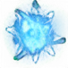
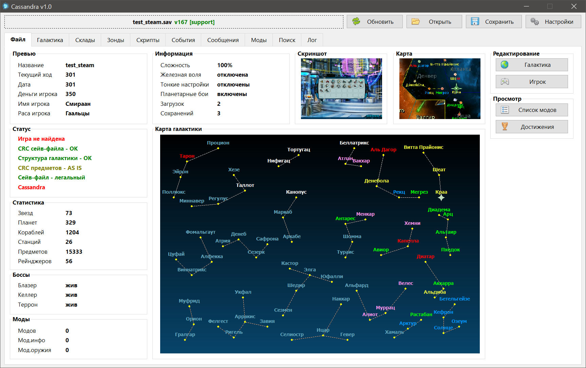

#  Cassandra

Save Editor for [Space Rangers HD](https://store.steampowered.com/app/214730/Space_Rangers_HD_A_War_Apart/).

## English

### Current Features:
- **View and Edit** almost all data within the save file.
- **Object Search** by ID and Name.
- **Stand-alone & Integrated Modes:** Works both with or without the game installed.
- **Recovery:** Ability to read and open corrupted or "problematic" save files.

### Temporarily Disabled:
- Support for modded save files.
- English localization.
- Full logging.

### Usage:
- [Download]((https://github.com/indiemagpie/Cassandra/releases)) and extract the `.exe` into the game’s root directory.
- **OR** manually specify the game path in the settings.
- **OR** use the editor in standalone mode (no game required).

### Important Tips:
- **Limited Functionality:** Without the original game files, some parameters will be unavailable for editing.
- **CRC Checks:** When opening a save file with mismatched or outdated mods, the CRC system may detect errors. The tool will attempt to auto-correct them; if correction fails, bonuses associated with those items will be removed to prevent further corruption.

---

## Русский

### Текущие возможности:
- **Просмотр и редактирование** практически всех данных в файле сохранения.
- **Поиск объектов** по ID и названию.
- **Гибкий режим работы:** редактор функционирует как с установленной игрой, так и без неё.
- **Чтение поврежденных файлов:** поддержка открытия проблемных сейвов.

### Временно отключено:
- Поддержка сохранений с модификациями (модами).
- Локализация на английский язык.
- Подробное логирование.

### Инструкция по использованию:
- [Скачайте](https://github.com/indiemagpie/Cassandra/releases) и распакуйте исполняемый файл (`.exe`) в корневую папку игры.
- **ИЛИ** укажите путь к папке с игрой в настройках программы.
- **ИЛИ** используйте редактор в автономном режиме (без файлов игры).

### Важные примечания:
- При работе без файлов игры функционал редактирования некоторых параметров будет ограничен.
- При открытии сохранения с неактуальным набором модов система проверки CRC может обнаружить ошибки. Программа попытается исправить их автоматически; в случае неудачи бонусы и характеристики поврежденных предметов будут удалены.

