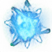
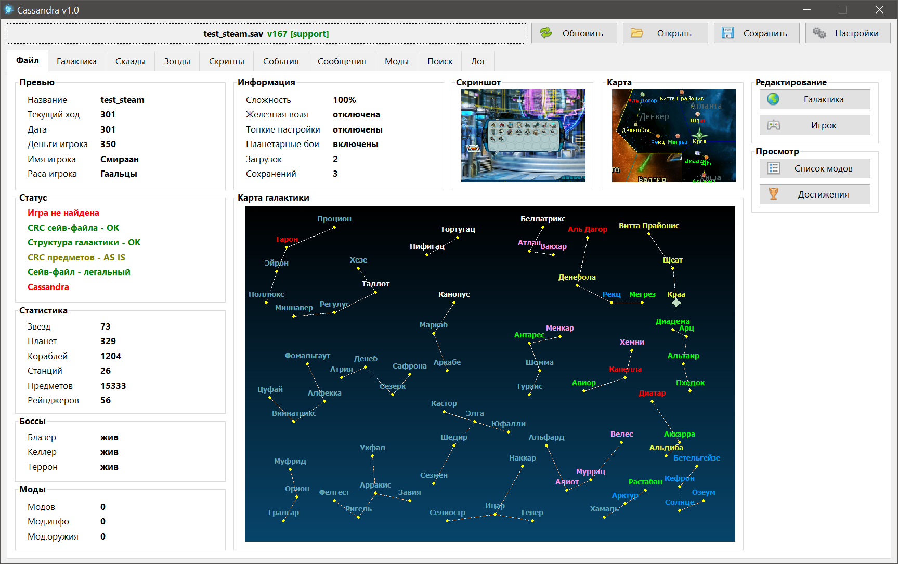

#  Cassandra

Save editor for [Space Rangers HD](https://store.steampowered.com/app/214730/Space_Rangers_HD_A_War_Apart/)

### Current features:
- Reading save files with active mods
- View, edit, and delete game objects
- Add new statuses and bonuses to ships
- Add extra bonuses to items
- Search for objects by ID, name, or type
- Works both with the game installed and as a standalone editor
- Support for reading corrupted save files
- Detailed logging

### Instructions for use:
- [Download](https://github.com/indiemagpie/Cassandra/releases) and extract the executable file (`.exe`) into the game's root folder
- **OR** specify the path to the game folder in the program settings
- **OR** use the editor in standalone mode

### Important notes:
- The language of the game and mod files is tied to the program's interface language
- When working without the game files, the functionality for editing certain parameters will be limited
- When opening a save file with outdated game files or mods, the CRC verification system may detect errors. The program will offer two options: 
  1) **Correction:** Looks for items within the game and mod files; if unsuccessful, the bonuses and stats of the corrupted items will be removed
  2) **Read AS IS:** Bonuses are preserved, but the ability to edit them will be restricted

### Credits
* Special thanks to Alexey Bondarchuk
